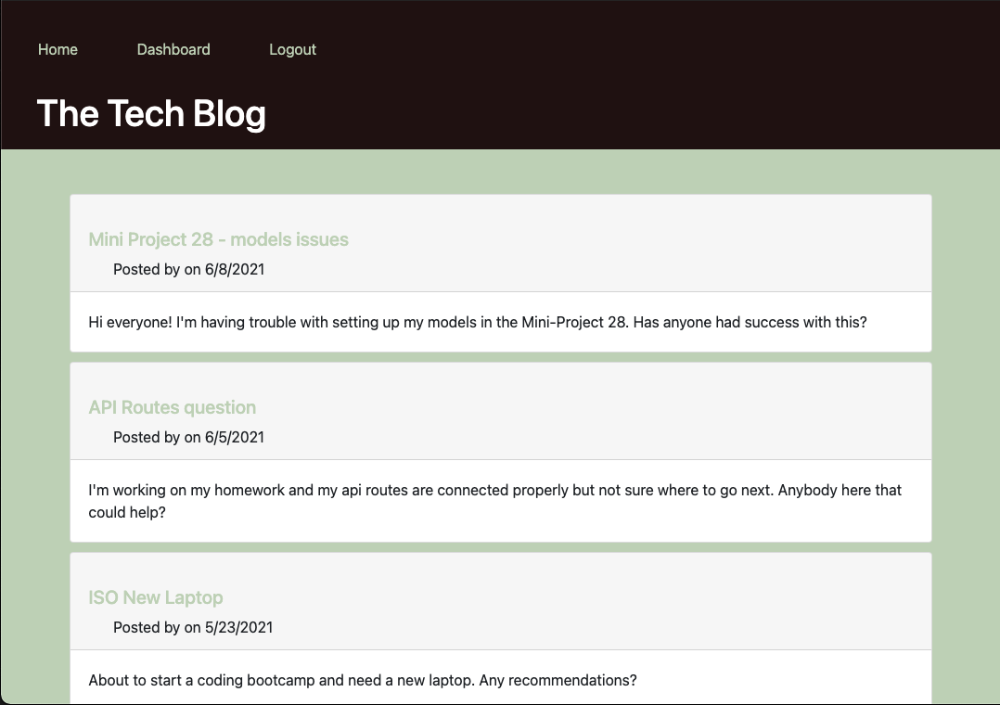

# Tech Blog

## Description
As a developer who writes about tech, the user has access to a CMS-style blog site where they can publish articles, blog posts, and their thoughts and opinions.
## Table of Contents
- [Installation](#installation)
- [Usage](#usage)
- [License](#license)
- [Contributing](#contributing)
- [Questions](#questions)
## Installation
To install necessary dependencies, run the following command:
```
npm i
```

## Usage
Express, express-handlebars, MySQL2, DOTENV, Sequelize, and bcrypt are required to use the Tech Blog. To begin, run npm run seed, then npm start.

A linked to my deployed page can be found here: [Heroku](https://hidden-dawn-08659.herokuapp.com/).




## License
This project is licensed under the: none.


## Contributing
There were no additional contributors to this project.

## Questions
If you have any questions about the repo, open an issue or contact me directly at boppcaitlin@gmail.com. You can find more of my work at [caitbopp](https://github.com/caitbopp).